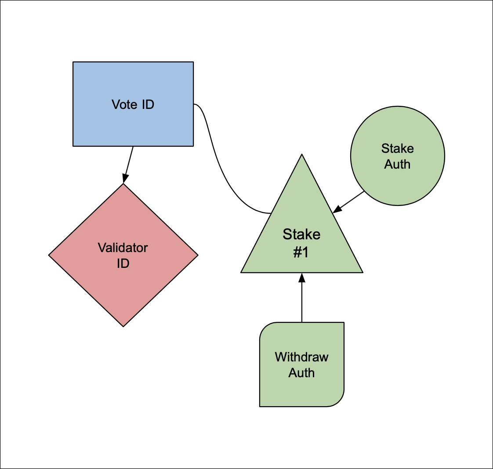

# Validator Accounts

## Creating a validator

The basic instructions to create validator are available [here](https://safecoin.org/validator-set-up-instructions/). But I went through those instructions and, while they get the job done, at the end of the process I still had many nagging questions.  So this verbiage expands on those directions and hopefully adds useful context, tidbits and tips so the directions are a little more satisfying.  Like, for example, what are the results of following those directions?  This is what things look like once you have completed the steps:



### Identity Account (Validator ID)

The identity account identifies a validator.  It also pays the fees for voting.  A validator is not validating if it does not vote and it can't vote without Safecoin.  Therefore the wallet for the identity account must be on the validator; it is a "hot" wallet.  So a big part of running a validator is simply monitoring that the wallet has SAFE, replenishing the balance when necessary and not keeping too much SAFE in the wallet because it is "at risk" simply by being on a server.

As an aside, there is nothing special about your identity account other than that the public key is being used to identify your validator. The identity account is in the *technical* sense a plain account and what I mean by plain is a safecoin account whose only data is  a balance in SAFE (that is to say, a balance in "lamports" where a "lamport" is one millionth of a safecoin)

#### Technical Digression
Using the `safecoin` CLI we can examine an ID account:
```
> safecoin account AGKU8t8CLPrns169ropzwepV3mrDaGbZEfbhy9zHyGFZ

Public Key: AGKU8t8CLPrns169ropzwepV3mrDaGbZEfbhy9zHyGFZ
Balance: 141.924963552 SAFE
Owner: 11111111111111111111111111111111
Executable: false
Rent Epoch: 99
```

The output needs some explanation (besides `Public Key` and `Balance`):  
* `Owner` is the program that understands the account.  In this case, `11111111111111111111111111111111` is the id of the system program which "owns" all normal accounts.  The owner of the *Safecoin* held in the account is whoever has the private key necessary to unlock and thus withdraw from the account. 
* `Rent Epoch` is the next epoch when the account will possibly pay rent.  Any accounts other than programs are charged rent to simply cover the cost of storage.  However this account does not pay rent because it is exceeds the rent exempt minimum.  We can see that by running `safecoin rent 128` (128 bytes required to store a plain account) to get the following:
```
Rent per byte-year: 0.00000348 SAFE
Rent per epoch: 0.000004878 SAFE
Rent-exempt minimum: 0.00178176 SAFE
```

* `Executable` is *false* meaning that this account is not a program.  But, yes, accounts can contain programs or indeed any other sort of data (up to 10 megabytes) as interpreted by the program which created (owns) the account.  Just for completeness, to see an executable account, we can take a peek at owner by (yet again) running `safecoin account`:
```
Public Key: 11111111111111111111111111111111
Balance: 0.000000001 SAFE
Owner: NativeLoader1111111111111111111111111111111
Executable: true
Rent Epoch: 0
Length: 14 (0xe) bytes
0000:   73 79 73 74  65 6d 5f 70  72 6f 67 72  61 6d         system_program
```
What about `NativeLoader1111111111111111111111111111111`, who owns that?
```
➜ safecoin account NativeLoader1111111111111111111111111111111
Error: AccountNotFound: pubkey=NativeLoader1111111111111111111111111111111
```
Whew that was a technical rathole!  On with the show.

Although nn theory, the identity account is all you need to run a validator, in pracice without a vote account the validator will not make any money because it won't be able to acquire stake.  A validator with no stake will never be scheduled to produce blocks nor do its votes "matter" since they only affect consensus if there is stake attached to the votes.  There *are* reasons to run a validator like this but if you are reading this article you probably don't care so moving on....

### Vote Account

The vote account is much more interesting and complicated than the Id account.  First of all, "Vote" is sort of a misnomer; what the vote account actually does is to aggregate stake.  Voting only matters to the extent that the voter has been staked.  So the vote account is the destination for stakes and when the validator votes it dedicates the total stake to the vote.  So the vote account represents (is the delegate for) stake which means money and power.  *But* the actual task of voting (that is, signing the votes) is performed by the "authorized voter" account and who is that?
In the basic setup, we used the command:
```
safecoin create-vote-account vote.json id.json
```

that command says that the vote account's authorized voter is the second parameter, which in this case is the id account.  ...so the vote account "votes" but it does not sign the votes and it does not pay for the votes, both of those tasks are performed by the validator (it's id account) it's role is sort of symbolic (maybe like the Queen of England, important but not really functional). 

Anyway, good way to understand the vote account is to consider what activities you can do to/with it.

* Change its commission.  The vote account receives rewards for voting based on the commission (as a percent 0-100) it sets.  The commission is charged against the rewards received by stakers at the end of each epoch.  Our default voter account has a zero percent commission but you can change that with the command `update-vote-commission` 

* Change the authorized withdrawer (the account needed to move safecoin out of the vote account.) Our default vote account sets the authorized withdrawer to the identity account and his is probably what you want for now. But for security risk management you will eventually need to use a separate withdrawer account that you don't store on the validator.

* Withdraw funds.  There is a specific command to do this `withdraw-from-vote-account` and to use that command you need access to the authorizer withdrawer's private key.  

* Change the vote authority, The default vote authority is the validator identity account.  Describing the when, why and how of this is beyond the scope of this article. 

* Switch validators!  Why the vote account would need/want to switch to a different validator is not super clear to the author but just know that it can be done. And when the vote account moves so does all the stake attached to it.

And just like with the ID account, lets take a peek at a vote account using the CLI:
```
Public Key: BHSX2WERLf4c7XAQcJSzeYyEva6vf5crVYjh2D7kSn14
Balance: 21.221481706 SAFE
Owner: Vote111111111111111111111111111111111111111
Executable: false
Rent Epoch: 99
Length: 3731 (0xe93) bytes
```
So we can see that vote accounts are indeed special because they are owned by the vote program (`Vote111111111111111111111111111111111111111`) and in addition to having a balance, can also have a fair amount of other data. 

### Stake Account

Safecoin/Solana uses "Proof of Stake" as its consensus mechanism, so Stake accounts are a critical piece of the validator ecosystem.  You can create a totally passive income stream of Safecoin by staking.  The system is designed such that stakers can buy into the cluster and assign their funds to a validator without any permission or trust.  In fact investors can stake using third party GUI tools such as wallets without touching the safecoin commandline perhaps using a smart phone or tablet.  

Of course as a person interested in running a validator you probably have your own Safecoin that you would like to stake....

The important thing to understand about staking and stake accounts is that Safecoin/Solana schedules are divided into epochs of (currently) roughly two days.  The epoch boundaries are the only times when stake can enter or leave  the cluster.  In a nutshell this is because during each epoch transition the leader schedule is created and leader slots are assigned according to stake: more stake means more leader slots (and a validator can only create a block when it is the cluster leader and a validator only receives rewards for the blocks it produces).  So in the following descriptions, all commands only take effect on epoch boundaries.  

The starter instructions have created a stake account and set a balance using the `safecoin create-stake-account` and then delegated the stake account to the vote account using `safecoin delegate-stake`.  You notice that there are a couple extra accounts, the stake authority and the withdraw authority.  Just like with the vote account, the withdraw authority controls withdrawal of coins.  The stake authority controls a number of different tasks:

* merging stake
* splitting stake
* delegating stake
* deactivating stake

As a happy Safecoin staker you might want invest more Safecoin on your own validator. Thats when you will notice that there is one critical task missing from the preceding list:  adding more SAFE to the stake!  Once the stake account is created it's value is fixed: you can not add additional Safecoin. The way to add staking balance is: 
- create yet another stake account, 
- wait until it is activated
- merge it into your primary stake account.  

It is also worth noting that stake can be re-delegated so if you find a better validator you can move to it.  A final interesting facet of stake accounts is that, while they can be delegated more than once, they can only deactivate once and at that point they are effectively ready to be "harvested", the only thing left to do is withdraw the entire account balance. 

Lastly, if you run the `safecoin account` command on a stake account the important thing you will see (besides a balance value) is:
```
Owner: Stake11111111111111111111111111111111111111
```
All the rules and actions for stake accounts are controlled by the Stake program

### Accounts Galore!

So if you are like me and create your validator with your own starting stake there are quite a few accounts to manage and be aware of.  Besides the Validator Identity, Vote and Stake accounts, there are up to four other accounts that can and probably should be used to control the access to critical administrative functions.  

### TL/DR

The most important information to remember is:

1. The only account whose whose whose keypair must be stored on the validator is the identity account.  The best practice is that you only fund the wallet with an amount of Safecoin you can afford to lose if the validator is hacked.

2. Assuming you are running a validator node and also staking that node, you will eventually need to understand all of the accounts described in this article.

3. There is a way to make your stake bigger.

